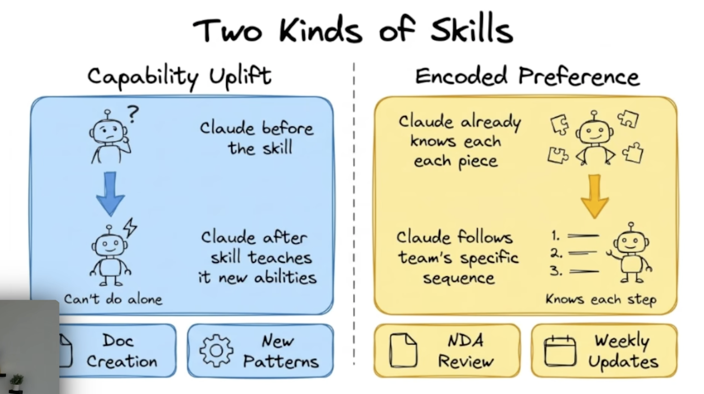
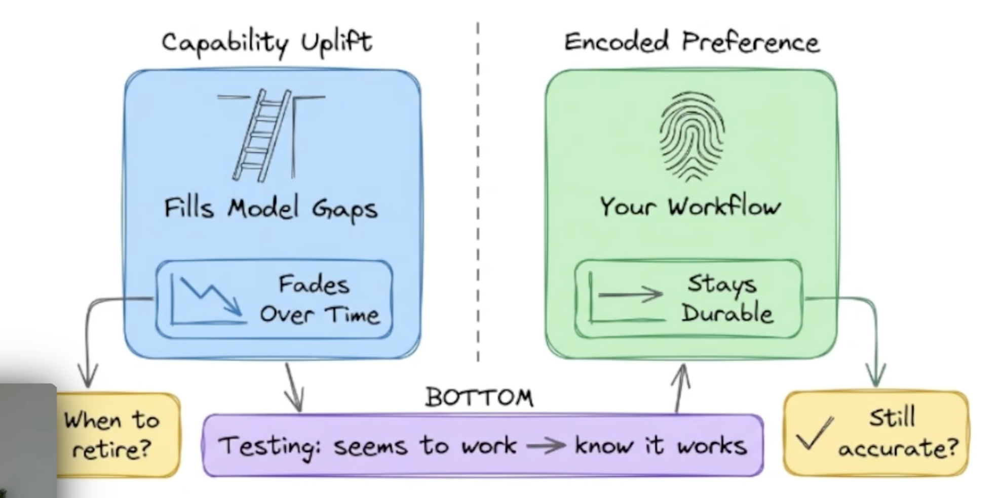
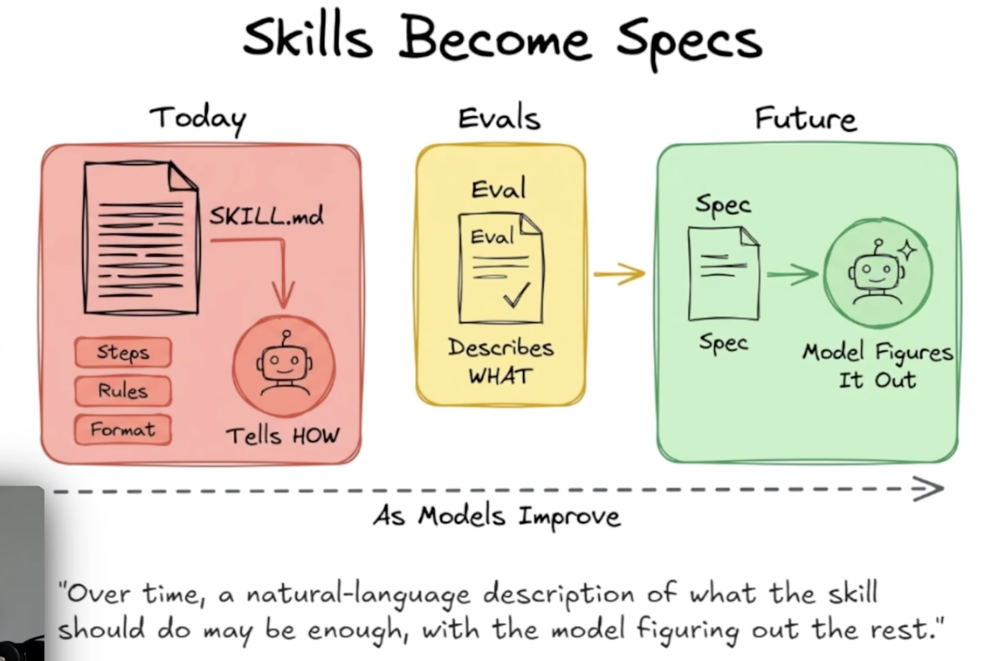

# Skill Builder Research

Research on how to think about and improve skills in the VibeData Skill Builder.

---

## Part A: Skill Taxonomy — Capability Uplift vs Encoded Preference

**Source**: [Anthropic Skills Video](https://www.youtube.com/watch?v=RAZVk5NPNtE)

### Two Kinds of Skills

There are two fundamentally different *technical* categories of skills (as opposed to functional/domain categories):

| | Capability Uplift | Encoded Preference |
|---|---|---|
| **Purpose** | Fills model gaps — teaches Claude things it can't do alone | Encodes your team's specific workflow and sequence |
| **Durability** | Fades over time as models improve | Stays durable — always reflects *your* choices |
| **Examples** | Doc creation, new patterns | NDA review, weekly updates |
| **Key question** | When to retire? | Still accurate? |
| **Lifecycle** | Temporary — eventually the model figures it out natively | Permanent — preferences don't become obsolete |

### Skills Become Specs

As models improve, skills evolve from **HOW instructions** (steps, rules, format) toward **WHAT specs** (a natural-language description of the desired outcome, with the model figuring out the rest). Evals bridge the gap — they describe *what* good output looks like, enabling the transition from prescriptive skills to declarative specs.

### Implications for Skill Builder

This taxonomy doesn't change the Skill Builder's implementation, but it changes how we **frame and manage** skills:

1. **Tagging**: Skills may be tagged as "capability uplift" or "encoded preference" so users know which will need retirement review vs ongoing accuracy checks.
2. **Retirement signals**: Capability uplift skills should be periodically re-evaluated — if the base model can now do the task without the skill, it's time to retire or simplify.
3. **Spec migration**: As models improve, capability uplift skills can be progressively simplified from detailed HOW instructions to minimal WHAT specs. The eval framework (Part B) provides the safety net to validate that simplified skills still produce good output.

---

## Part B: Anthropic Skill Builder Changes — Eval & Tuning Workflow

**Source**: [Anthropic skills repo commit](https://github.com/anthropics/skills/commit/3d59511518591fa82e6cfcf0438d68dd5dad3e76)

**Full analysis**: [skill-builder-comparison-20260307.md](skill-builder-comparison-20260307.md)

### What Changed

Anthropic released significant updates to how their skill creator **evaluates, compares, grades, and optimizes** skills. Their workflow now includes:

- **Assertion-based grading** — structured PASS/FAIL checks with cited evidence (not just qualitative rubrics)
- **Blind A/B comparison** — outputs labeled "A"/"B" judged without knowing which had the skill
- **Multi-run variance analysis** — each eval runs 3x to distinguish real improvement from noise
- **Description optimization loop** — automated testing of whether Claude actually triggers the skill, with train/test split to prevent overfitting
- **Human-in-loop eval viewer** — HTML review page with per-case feedback that feeds back into iteration

### Key Gaps Identified in VibeData Skill Builder

VibeData's Skill Builder has a **stronger creation funnel** (research, elicitation, scope guardrails, interactive refinement, GUI). What it lacks is the **measurement and optimization tail**:

| Gap | Why It Matters |
|-----|---------------|
| No quantitative assertions | Can't objectively measure if a skill improves output |
| No description optimization | A skill that never triggers is useless regardless of quality |
| No multi-run variance | Single runs can't distinguish improvement from luck |
| No structured feedback loop | Test results in markdown; no machine-readable feedback for iteration |

### Recommended Adoption Sequence

| Phase | Items | Effort |
|-------|-------|--------|
| **Phase 1** | Assertion-based eval framework + Description optimization | 3 weeks |
| **Phase 2** | Grader agent with claim extraction + Eval viewer UI | 2 weeks |
| **Phase 3** | Multi-run variance (behind "Thorough Test" toggle) | 1 week |
| **Phase 4** | Blind A/B comparison + Benchmark aggregation | Later |

### What NOT to Adopt

- Filesystem-only state (SQLite is better)
- CLI-only experience (Tauri GUI is a competitive advantage)
- Generic single-pattern skills (purpose-driven patterns are more valuable)
- Manual workspace directory conventions (already managed)

---

## Files in This Directory

| File | Description |
|------|-------------|
| `README.md` | This summary |
| `skill-builder-comparison-20260307.md` | Full RFC comparing VibeData and Anthropic skill builder workflows |
| `skill-desc-change1.png` | Screenshot: "Skills Become Specs" evolution diagram |
| `skill-desc-change2.png` | Screenshot: Capability Uplift vs Encoded Preference (detailed) |
| `skill-desc-change3.png` | Screenshot: Two Kinds of Skills overview |
