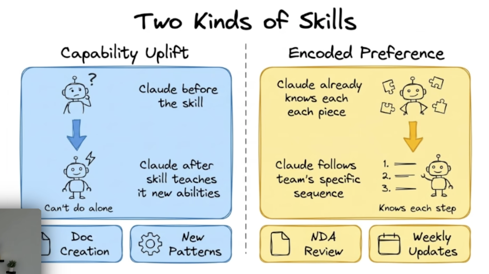
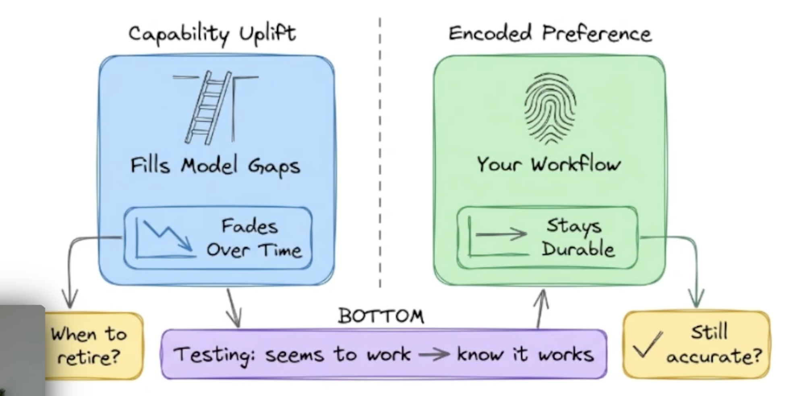
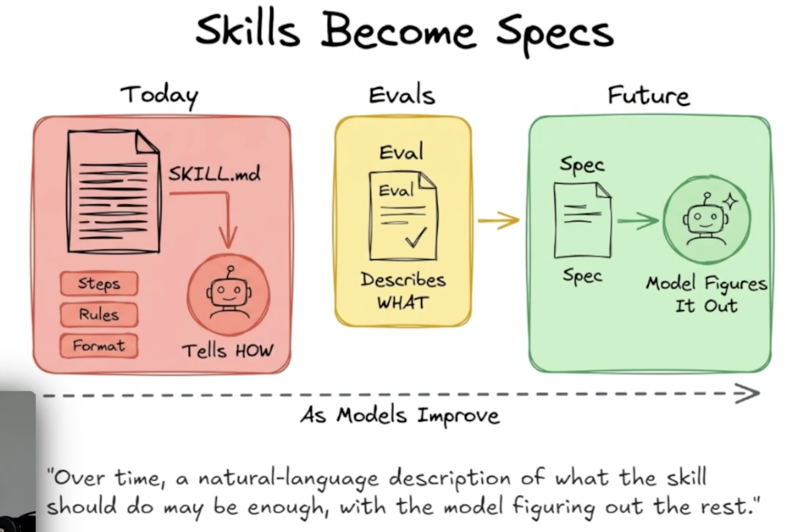

# Skill Builder Research

Research into how we think about skills technically and how Anthropic's recent skill-creator changes should inform VibeData's Skill Builder.

---

## Part A: Two Kinds of Skills — A Technical Taxonomy

**Source**: [Anthropic YouTube — Skills Deep Dive](https://www.youtube.com/watch?v=RAZVk5NPNtE)

The video introduces a useful technical framing for skills that differs from our current functional categorization (knowledge-capture vs standards). It splits skills into two categories based on their **durability**:

### Capability Uplift

Skills that fill gaps in the model's current abilities — things Claude *can't do alone* today.

- **Examples**: Doc creation patterns, novel coding patterns, unfamiliar tool usage
- **Characteristic**: The skill teaches Claude new abilities (steps, rules, format)
- **Lifecycle**: **Fades over time** as models improve — these are candidates for retirement
- **Key question**: *When to retire?*



### Encoded Preference

Skills that capture a team's *specific* workflow — things Claude already knows the pieces of, but needs to follow *your* sequence.

- **Examples**: NDA review process, weekly update format, code review checklists
- **Characteristic**: Claude knows each piece; the skill encodes the team's preferred order and emphasis
- **Lifecycle**: **Stays durable** — these survive model upgrades because they encode *your* choices, not model limitations
- **Key question**: *Still accurate?* (workflow may have changed)



### Skills Become Specs

The most forward-looking insight: as models improve, skills evolve from prescriptive HOW instructions into declarative WHAT specifications.

| Stage | Skill Contains | Model Does |
|-------|---------------|------------|
| **Today** | Steps, rules, format (tells HOW) | Follows instructions |
| **Evals** | Describes WHAT good output looks like | Measured against expectations |
| **Future** | Spec only (natural language description) | Figures it out |

> *"Over time, a natural-language description of what the skill should do may be enough, with the model figuring out the rest."*



### Implications for Skill Builder

This taxonomy doesn't change our Skill Builder implementation today, but it reshapes how we think about the **boundary**:

1. **Capability Uplift skills have a shelf life.** We should track which skills are in this category and periodically evaluate whether newer models have absorbed the capability. A "retirement check" feature becomes valuable.
2. **Encoded Preference skills are the durable moat.** These are where the compounding value lives — team-specific workflows that no model upgrade replaces. Our research-driven creation process is especially well-suited for capturing these.
3. **Evals are the bridge.** The transition from HOW-skills to WHAT-specs runs through evals. This connects directly to Part B — the measurement infrastructure we're missing is exactly the eval layer that enables this evolution.

---

## Part B: Anthropic Skill Creator Changes — Eval & Optimization

**Source**: [Anthropic skills repo commit 3d59511](https://github.com/anthropics/skills/commit/3d59511518591fa82e6cfcf0438d68dd5dad3e76)

**Full analysis**: [skill-builder-comparison-20260307.md](skill-builder-comparison-20260307.md)

Anthropic shipped major changes to their skill-creator: a full eval/tuning pipeline with quantitative grading, blind comparison, variance analysis, and description optimization. The RFC compares this against VibeData's Skill Builder in detail.

### TL;DR

**Where VibeData leads**: Research depth, knowledge elicitation, scope guardrails, interactive refinement, GUI, distribution/marketplace.

**Where VibeData lags**: Everything after skill creation — measurement, optimization, and feedback loops.

### Key Gaps to Close

| # | Gap | What Anthropic Does | Why It Matters |
|---|-----|-------------------|----------------|
| R1 | **No quantitative assertions** | Assertion-based grading with evidence citing | Can't objectively measure if a skill improves outcomes |
| R2 | **No trigger testing** | Automated description optimization with train/test split | A skill that never triggers is useless regardless of quality |
| R3 | **No variance analysis** | 3x runs per config, mean +/- stddev, flaky detection | Single runs can't distinguish real improvement from noise |
| R4 | **No grader agent** | Claim extraction, assertion grading, eval critique | Validation checks conformance to format, not output quality |
| R5 | **No structured feedback** | HTML eval viewer with per-case feedback → next iteration | Test results in markdown don't flow back into improvement |

### Adoption Sequence

```
Phase 1 (Weeks 1-3):  R1 (Assertions) + R2 (Description Optimization)
                       → "Does the skill help?" + "Does Claude invoke it?"

Phase 2 (Weeks 4-5):  R4 (Grader Agent) + R5 (Eval Viewer UI)
                       → Deeper measurement + human-in-loop feedback

Phase 3 (Week 6):     R3 (Multi-Run Variance)
                       → Behind "Thorough Test" toggle

Phase 4 (Later):      Blind A/B Comparison + Benchmark Aggregation
                       → When automated CI testing of skill quality is needed
```

### What NOT to Adopt

- Filesystem-only state (SQLite is better)
- CLI-only experience (Tauri GUI is a competitive advantage)
- Generic single-pattern skills (our purpose-driven patterns are more valuable)
- The "vibe with me" fallback (our structured research phase is the differentiator)

### Strategic Frame

VibeData's Skill Builder covers a **wider and deeper creation funnel**. What it lacks is the **measurement and optimization tail**. The adoption plan preserves our front-end advantages while grafting on Anthropic's back-end rigor — enabling the "domain intelligence that compounds" promise to be *demonstrable*, not just aspirational.

---

## Files

| File | Description |
|------|-------------|
| [skill-builder-comparison-20260307.md](skill-builder-comparison-20260307.md) | Full RFC: capability comparison matrix, detailed analysis, adoption recommendations |
| [yt-screen-1.png](yt-screen-1.png) | Two Kinds of Skills — Capability Uplift vs Encoded Preference |
| [yt-screen-2.png](yt-screen-2.png) | Durability — Fades Over Time vs Stays Durable |
| [yt-screen-3.png](yt-screen-3.png) | Skills Become Specs — Today → Evals → Future |
